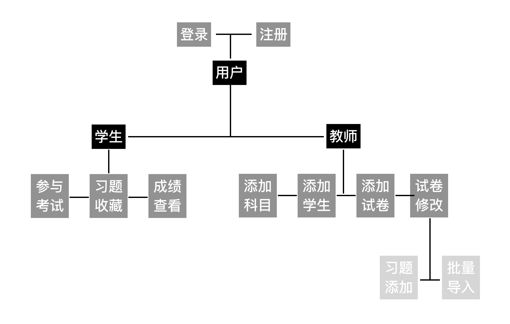
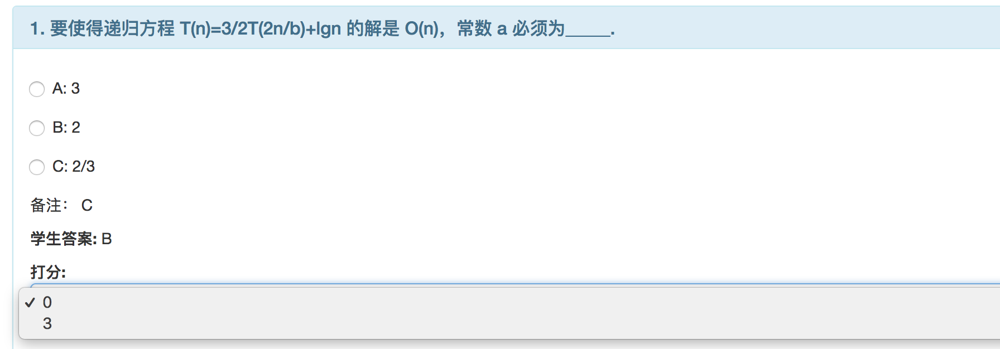
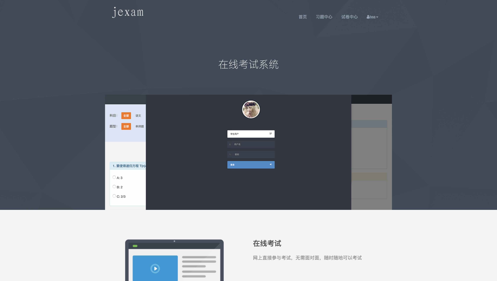
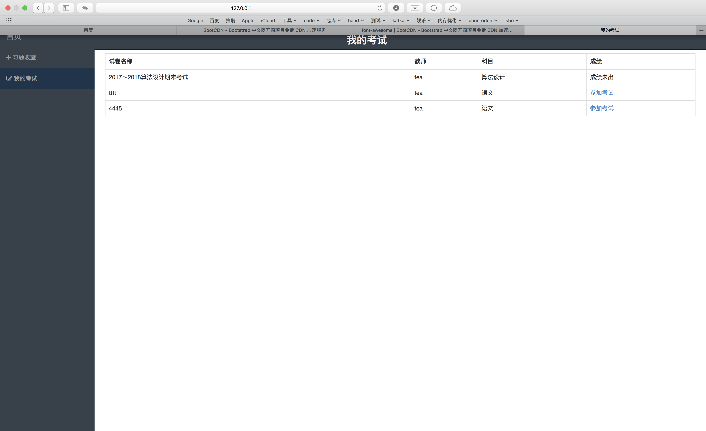
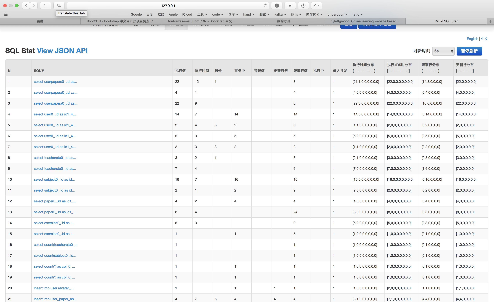

##  项目所使用技术
- mysql：数据库
- spring boot： 快速开发框架
- spring IOC: 依赖注入
- spring mvc：MVC框架
- spring data jpa：ORM框架
- druid：数据库监控连接池
- freemarker： 模版引擎
- bootstrap：CSS框架
- slf4j+log4j2：日志
- ehcache：缓存

## 亮点
- 性能

    > 采用了CDN加速和HTTP压缩技术，减轻服务器压力并提高相应时间，后端采用ehcache缓存经常用到但不常修改的数据，提高响应速度。
    
    ```
    CDN（index.ftl）：
    <script src="https://cdn.bootcss.com/jquery/3.0.0/jquery.min.js"></script>
    <script src="https://cdn.bootcss.com/bootstrap/3.1.1/js/bootstrap.min.js"></script>
    <link href="https://cdn.bootcss.com/bootstrap/3.1.1/css/bootstrap.min.css" rel="stylesheet">
    <link href="https://cdn.bootcss.com/font-awesome/4.7.0/css/font-awesome.min.css" rel="stylesheet">
    
    HTTP压缩(application.yaml)：
    server:
        compression:
            min-response-size: 512
            enabled: true
            mime-types: text/html,text/css,text/javascript,application/javascript,image/gif,image/png,image/jpg
    
    
    ehcache缓存(ehcache.xml, SubjectServiceImpl)
    <cache name="subjects"
               maxElementsInMemory="1"
               overflowToDisk="false"
               diskPersistent="false"
               diskExpiryThreadIntervalSeconds="1800"
               memoryStoreEvictionPolicy="FIFO"
        />
    @Cacheable(value = "subjects", key = "1")
        @Override
        public List<Subject> getAllSubjects() {
            Iterable<Subject> subjectIterable = subjectRepository.findAll();
            List<Subject> list = new ArrayList<>();
            subjectIterable.forEach(t -> list.add(t));
            return list;
        }
    @Caching(evict = @CacheEvict(value = "subjects", key = "1"))
    @Override
    public void addSubject(String name) {
        int num = subjectRepository.countByName(name);
        if (num > 0) {
            throw new RuntimeException("error.subject.exist");
        }
        subjectRepository.save(new Subject(name));
    }
    ```
    
- 安全性
    > 虽然没有使用权限引擎，但请求比较严格遵守restful规范，每次操作该资源时才先代码校验当前用户有无该资源的权限。前端将密码加密，防止密码抓包时可见等
    
    ```
    密码前端加密，防止密码泄露(login.ftl)
    $("#login-button").bind("click",
                function() {
                    var b, a = document.forms[0];
                    a.action = "/login.do",
                    b = document.loginForm.passBefore.value,
                    document.loginForm.password.value = md5(b),
                    document.loginForm.role.value=getType();
                    a.method = "post",
                    a.submit()
                })
    
    
    检查操作权限(PaperServiceImpl)
    public void deletePaper(long paperId, long teacherId) {
        Paper paper = paperRepository.findOne(paperId);
        if (paper == null) {
            return;
        }
        if (paper.getOwnerId() != teacherId) {
            throw new CommonException("error.paper.delete.noPermission");
        }
        paperRepository.delete(paper);
    }
    ```
    
- 代码分层
    > 代码严格分为controller(控制器)，service(业务逻辑层)，repository(数据操作层)三层。使用JSP会插入java代码，不利于前后端严格分层，因此采用了性能也更高的freemarker模板引擎。
    
- 答题
    > 答题时有倒计时功能，到达结束时间自动提交。为了防止作弊，禁用页面的复制和鼠标右键。
 
    禁用页面的复制和鼠标右键(answer_paper.ftl
    ```
    $(function(){
                document.oncontextmenu = function(){
                    event.returnValue = false;
                }
                document.onselectStart = function(){
                    event.returnValue = false;
                }
                document.oncopy = function(){
                    event.returnValue = false;
                }
                timer(intDiff);
            });
    ```
    
    
    
    
- 细节
    > 为了考虑易用性，比如老师批阅试卷时批改单选题给分的时候只有0分要么全分等。
    
     
    
- 页面
    > 页面简洁美观，采用了较为平面化的设计，且为了适配不同尺寸的显示器，采用了响应式处理。
    
    页面优美
    
    
    响应式页面
    
    

   